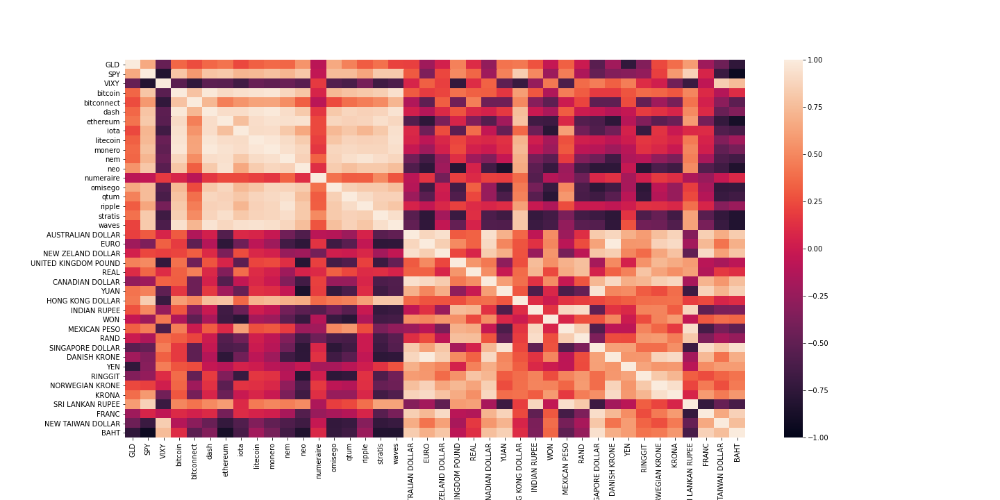
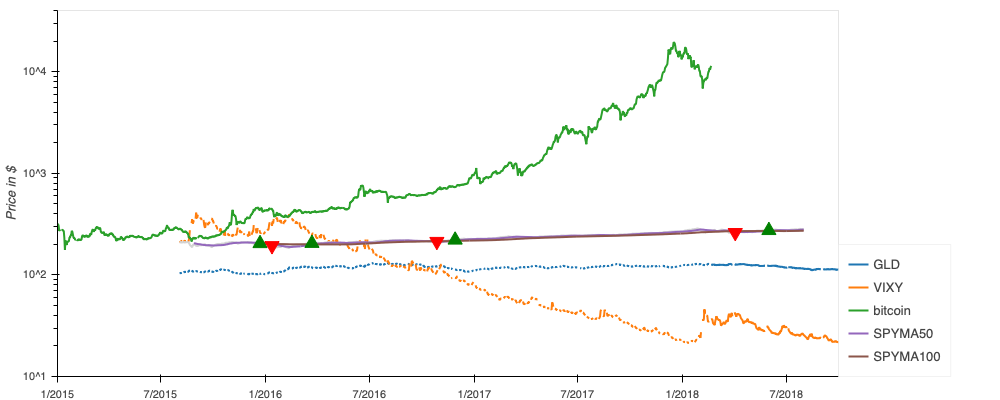

# Currencies-valuations
Crypto currency valuations for assets diversification

## Contributors

@weidongli20 et al.

## Technology Stack

- Python, Pandas, Numpy, Matplotlib, plotly

## About

- Crypto currencies valuation for assets diversification: Datasets include 15 crypto currencies historical prices, 22 fiat currencies historical prices in US dollar, 3 indices ETF’s, and 2020 inflation rates of 19 Fiat currencies

## Installation Instructions

1. Clone the repository
2. Install dependencies
3. Run using Jupyter Lab

## Screenshots

Correlation heatmap

Correlation plots

## License

- Free

## Contact

#### Developer/FinTech Developer

- Name: Weidong Li (@weidongli20)
- GitHub: [weidongli20](https://github.com/weidongli20)
- e-mail: 4531holly@gmail.com
- LinkedIn: [https://www.linkedin.com/in/weidongli20/](https://www.linkedin.com/in/weidongli20/)